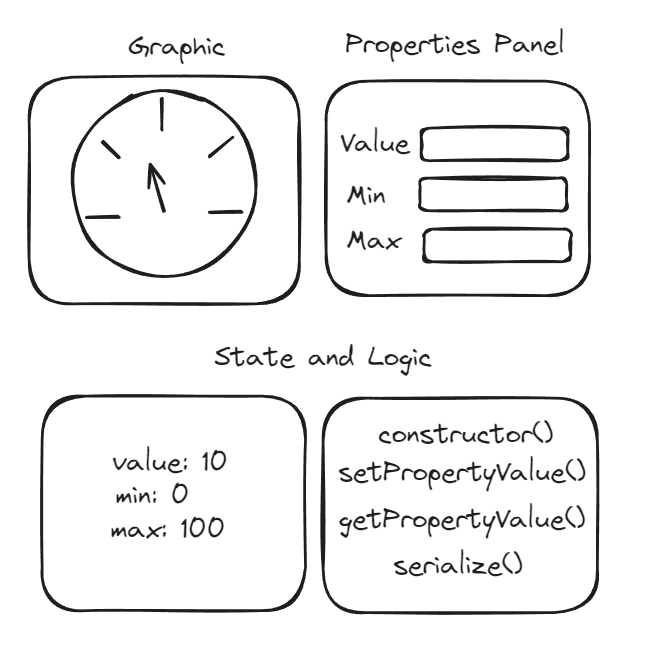
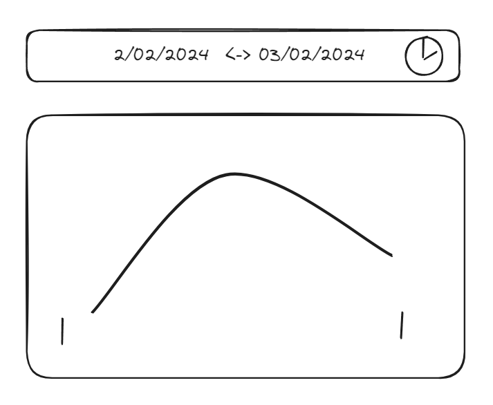
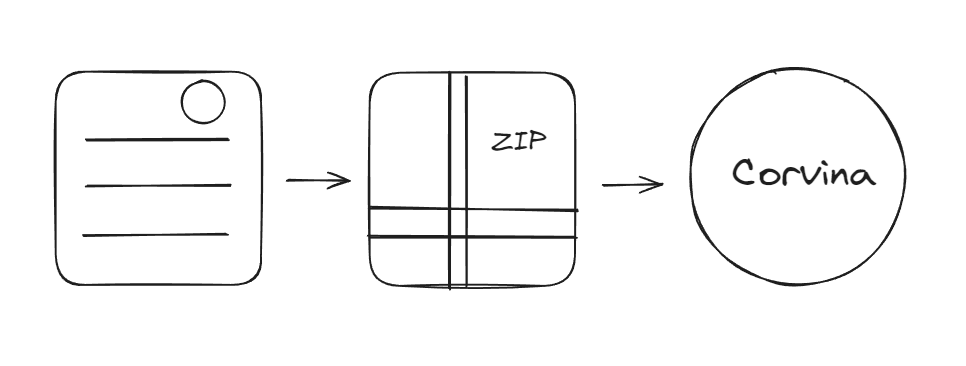

# Software Development Kit for Corvina Widgets
Create your own widget

---

# Agenda

1. Installation
1. Connecting to Corvina Instance
1. Widget Structure
1. Accessing Historical Data
1. Deployment
  
---
# Installation

- Download the SDK [https://exorint.atlassian.net/wiki/spaces/CVTS/pages/564166658/Corvina+SDK+dashboard+widget](https://exorint.atlassian.net/wiki/spaces/CVTS/pages/564166658/Corvina+SDK+dashboard+widget)

- Get the Documentation 
  [https://docs.corvina.cloud/docs/sdk-dashboard-widget/Overview](https://docs.corvina.cloud/docs/sdk-dashboard-widget/Overview)

  
- Install Dependencies and Run the Project
  ```bash	
  yarn install
  yarn run dev
  ```	
---

# Connecting to Corvina Instance

Configure the connection to your Corvina instance using index.ts

```javascript
initCorvina( ()=> {
  const domain = "corvina.cloud";
  const organization = "exor";
  setCommunicationSettings(domain, organization);
  console.log(CommunicationSettings)
});
```

---
# Widget structure

- **Graphic Representation**

- **State, Logic, and Serialization**

- **Gallery and Properties Panel**
  


---

# Historical Data

- **Reading Historical Data**
  - Access and analyze past data records.

- **Dashboard Global Clock**
  - Utilize the global clock for time-based data.


---

# Deploy

- Configure the Manifest file
- Build your widget
- Upload the widget to your organization
  

---

Thanks for your attention!
